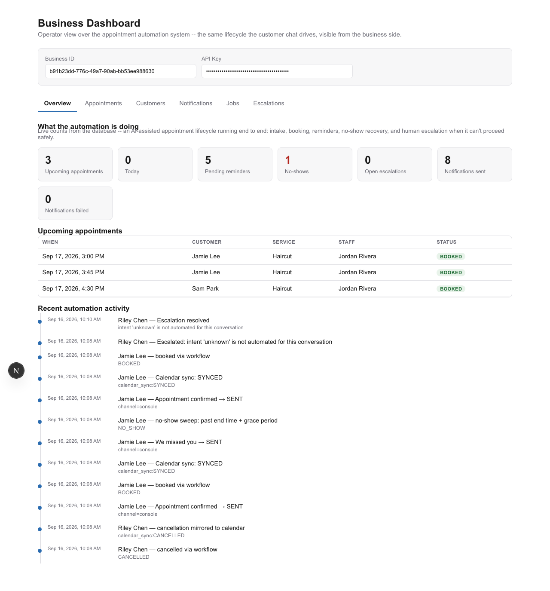
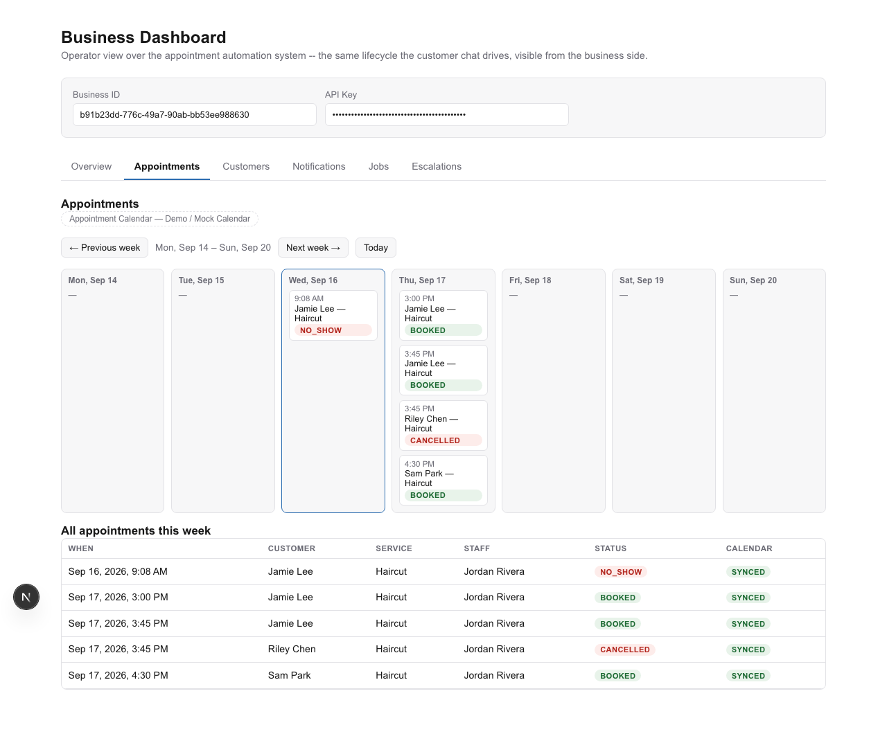
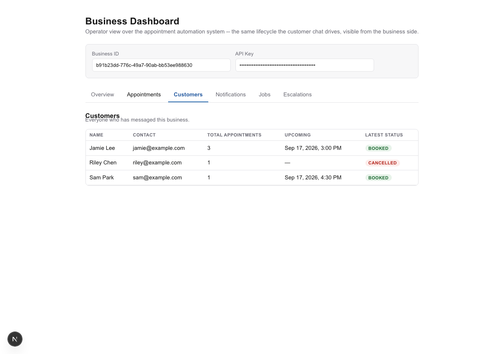
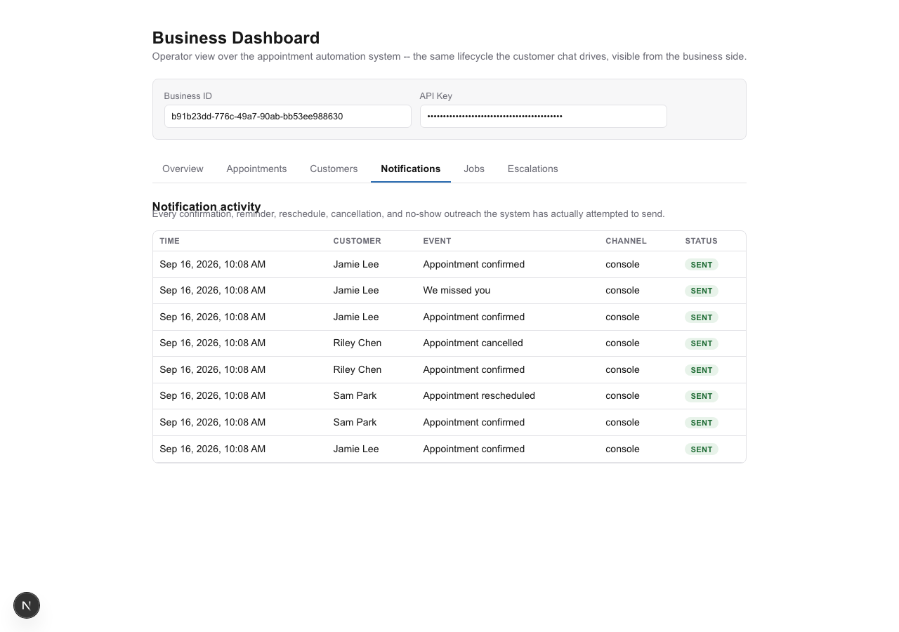
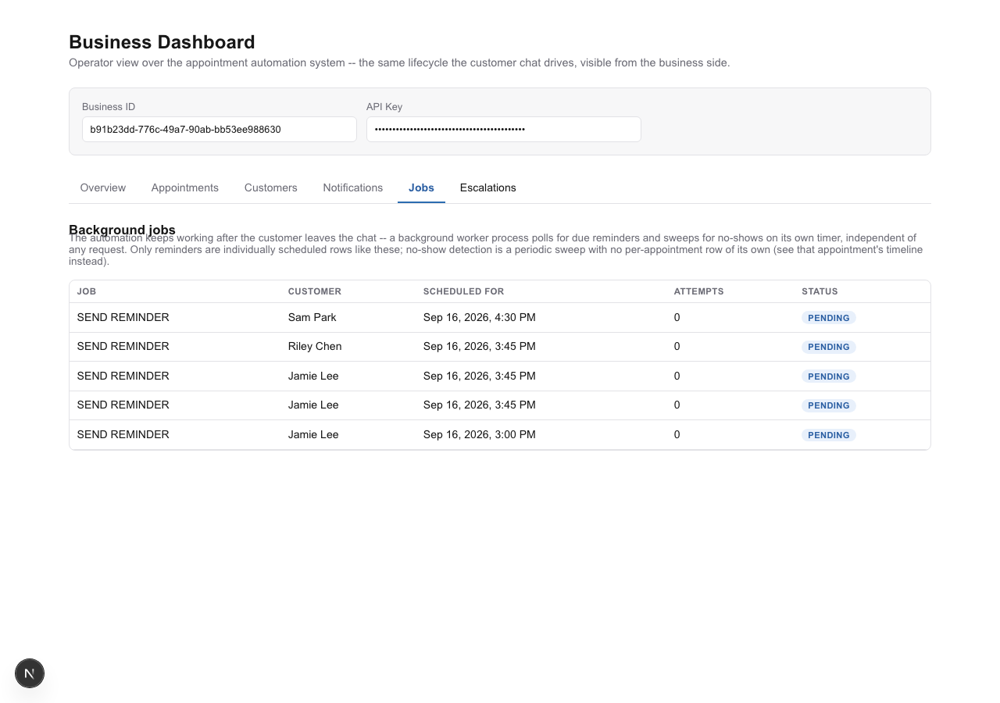

# Appointment Lifecycle Automation

An AI-assisted appointment lifecycle automation system: request intake →
AI interpretation → deterministic availability & booking → confirmation →
reminders → completion / cancellation / no-show → recovery & rebooking →
human escalation when automation can't safely proceed.

**This is a public repository, released under the [MIT License](LICENSE)** —
free to use, modify, and adapt.

## Why this exists

Most "AI books your appointment" demos let the model decide whether a slot
is free. That's the wrong place to put that decision: a model has no way to
guarantee it won't double-book two customers into the same slot, and
"probably fine" isn't a standard a real scheduling system can run on. This
project draws that boundary deliberately — **AI for interpretation,
deterministic systems for control.** The model turns a customer's free-text
message into a structured, validated request; it never decides availability,
never prevents (or causes) a double booking, and never authorizes a booking
on its own. A Postgres exclusion constraint does that, unconditionally, even
under real concurrent requests. Everything downstream of a booking —
reminders, no-show detection, recovery, escalation — follows the same rule:
the model interprets language, code decides what happens to the appointment.

## Status

| Capability | Status |
|---|---|
| Deterministic availability engine + atomic booking | ✅ Real — Postgres range-exclusion constraint, proven under a real concurrent-request race (`tests/domain/test_concurrency.py`) |
| AI interpretation layer (intent, service, date/time, ambiguity) | ✅ Real — live-verified against the real Anthropic API; confidence is advisory-only, never a booking gate |
| Bounded clarification (customer chat) | ✅ Real — max 2 rounds, then escalates; live-verified end to end through the browser chat UI |
| Cancellation & rescheduling | ✅ Real — shared notice-window policy, re-validated transactionally against live availability |
| Background jobs — reminders, no-show detection, recovery, rebooking | ✅ Real — a second worker process on a 60s poll loop, coordinated purely through Postgres (`SELECT ... FOR UPDATE SKIP LOCKED`), no queue/broker |
| No-show recovery & rebooking | ✅ Real — reuses the clarification machinery; the original `NO_SHOW` appointment is preserved immutably, a new appointment is created |
| Human escalation | ✅ Real — ambiguous intent, unmatched service, or multiple candidate appointments escalate cleanly rather than guessing |
| Workflow / audit trail | ✅ Real — every state transition and execution step is a persisted row (`AuditEvent`, `WorkflowStep`), queryable per-request via `GET /v1/requests/{id}/trace` |
| Per-business API-key authentication | ✅ Real — SHA-256 hashed, `Authorization: Bearer` on every business-scoped endpoint (two documented exceptions, see [Known limitations](#known-limitations)) |
| Real notification delivery (Resend) | ✅ Real — provider implemented and unit-tested against a mocked transport; **live-verified once against the real Resend API**, confirmed delivered via the Resend dashboard |
| Calendar sync | 🟡 Mock — `MockCalendarProvider` behind a `CalendarProvider` Protocol; a real Google Calendar adapter is deliberately deferred (see [Known limitations](#known-limitations)) |
| Operator dashboard | ✅ Real UI over real data — six tabs (Overview, Appointments, Customers, Notifications, Jobs, Escalations), every number computed live from the database, **currently loaded with synthetic demo data** (see [Screenshots](#screenshots--demo)) |
| Test-suite isolation from the dev/demo database | ✅ Real — see [Testing](#testing) |

**161/161 backend tests passing.** Every row above marked "Real" is covered
by the automated suite (fake AI interpreter, no network calls, no cost).
"Live-verified" rows additionally had a real Anthropic and/or Resend call
made against them at least once during development, on top of the
deterministic tests. This system is **not** described anywhere in this repo
as "production-ready" — see [Known limitations](#known-limitations) for what
that would still require.

## How it works

```
Customer message ("I'd like a haircut Thursday afternoon")
      │
      ▼
AI interpretation        structured intent + service + date/time + confidence
                          (never trusted as a decision — see below)
      │
      ▼
Bounded clarification     ambiguous? ask once, twice, then escalate to a human
      │
      ▼
Deterministic slots       working hours, blocked time, buffers, notice/horizon
                          policy, checked against real DB state
      │
      ▼
Booking                   Postgres exclusion constraint — a slot cannot be
                          double-booked, even under a real concurrent race
      │
      ▼
Confirmation notification  best-effort, never blocks or reverses a committed
                          booking if it fails
      │
      ▼
Calendar sync (mock)       best-effort, recorded and retryable independently
                          of the booking's own status
      │
   ┌──┴───────────────────────────────────────┐
   ▼                                           ▼
Reminder (background worker)          Cancellation / reschedule
   │                                   (customer-initiated, notice-window
   ▼                                    gated, re-validated transactionally)
No-show sweep (periodic, deterministic:
now > end_at + grace period)
   │
   ▼
Recovery — reuses the clarification loop, original NO_SHOW record
preserved immutably, a new appointment created on success
```

Any point where the model is uncertain, a service can't be matched, or more
than one appointment could be the one a customer means, routes to a human
escalation queue instead of guessing — visible on the operator dashboard.

## Architecture

| Component | Location | Role |
|---|---|---|
| API | `backend/app/api/` | FastAPI — thin HTTP layer; no booking/availability logic lives here |
| Domain core | `backend/app/domain/` | Schema, deterministic availability engine, atomic booking, cancellation/reschedule, no-show predicate |
| AI interpretation | `backend/app/ai/` | Provider-agnostic `Interpreter` Protocol; `providers/claude.py` (real) and `providers/fake.py` (tests, no network) |
| Workflow orchestrator | `backend/app/workflow/` | The one module composing `domain` and `ai` — two state machines (`ProcessingRun`, `Appointment`), audit trail, notification/calendar dispatch |
| Background jobs | `backend/app/worker.py`, `app/workflow/jobs.py` | Second process, 60s poll loop; reminders (`ScheduledJob`, row-locked) + periodic sweeps (no-shows, expiring runs) |
| Notifications | `backend/app/workflow/notifications*.py` | `NotificationService` Protocol — console (dev default), mock (tests), Resend (real) |
| Calendar | `backend/app/workflow/calendar.py` | `CalendarProvider` Protocol — `MockCalendarProvider` only; real Google Calendar adapter deferred |
| Dashboard API | `backend/app/api/routes_dashboard.py` | Read-only endpoints assembled from existing audit/notification/job data — no new business logic |
| Dashboard UI | `frontend/` | Next.js (App Router, TypeScript) — six-tab operator dashboard, thin typed API client, no framework beyond React |
| Chat UI | `backend/static/chat/` | Single static HTML file, inline CSS/JS, no build step — the customer-facing entry point |
| Persistence | `backend/alembic/`, PostgreSQL 16, SQLAlchemy 2.0 (async) | Every schema change is a reviewed migration |
| CI | `.github/workflows/ci.yml` | Secret scan (gitleaks), backend lint + tests, frontend typecheck + lint + build, production image build check |

## AI decides vs. deterministic code decides

| AI decides | Deterministic code decides |
|---|---|
| What the customer's message means (intent, service, date/time) | Whether a slot is actually available — a real Postgres constraint, not a model's belief |
| Its own confidence in that interpretation | Whether confidence is high enough to act on — it never is; confidence is advisory-only, logged but never a gate |
| The clarifying question to ask when ambiguous | How many clarification rounds are allowed (2, hard cap, then escalate) |
| — | Whether a booking commits — a transactional check against live availability, re-validated even for a slot offered moments earlier |
| — | Whether a no-show occurred (`now > end_at + grace_period`, a pure predicate) |
| — | Whether a notification or calendar-sync failure blocks or reverses a committed appointment (never) |
| — | Which appointment a cancel/reschedule request applies to — exactly one unambiguous match, or escalate; the system never guesses among several |

## Engineering decisions worth calling out

- **AI sits at the unstructured-language boundary only.** Once a message is
  interpreted, everything downstream — availability, booking, cancellation,
  no-shows, escalation — is ordinary deterministic code with no model in the
  loop.
- **Booking is revalidated transactionally, not trusted from the offer.** A
  slot shown to a customer a moment earlier is re-checked against real
  database state at confirmation time; if a concurrent request took it, the
  workflow re-offers fresh availability instead of failing outright.
- **PostgreSQL — not application code — prevents overlapping appointments.**
  A range-exclusion constraint on `appointments` is the actual guarantee,
  proven with a real concurrent-request test, not just believed correct by
  inspection.
- **Calendar sync happens after the booking commits, and a sync failure
  never unwinds it.** `calendar_sync_status` is tracked independently of the
  appointment's own status so the two can never be confused.
- **A notification failure doesn't roll back a committed appointment,
  either.** The same discipline applies to email delivery as to calendar
  sync — a `FAILED` notification is a recorded fact, not a reason to undo a
  booking that already happened.
- **Background work is a separate process, not inline in a request.** A
  worker polls Postgres directly — reminders as claimed rows
  (`SELECT ... FOR UPDATE SKIP LOCKED`, safe with more than one worker),
  no-show detection as a periodic sweep. No Redis, no broker — nothing in
  this system's scale needs one.
- **No-show recovery creates a new appointment; it never mutates the
  original.** The `NO_SHOW` record stays immutable evidence of what
  happened; a successful rebooking is a new row linked back to it via
  `rebooked_from_id`.
- **Escalation is the correct outcome for real ambiguity, not a failure
  mode.** An unmatched service, an ambiguous reschedule, or more than one
  candidate appointment routes to a human queue — the system is designed to
  know what it doesn't know, rather than guess and risk a wrong booking.

## Screenshots / demo

The dashboard below is running against **synthetic demo data** — customers
named Jamie Lee / Sam Park / Riley Chen at `@example.com`, seeded through
the real chat/booking pipeline (not inserted directly into the database).
It demonstrates the dashboard's visualization, not a re-proof of the real
Resend integration (that was verified separately — see below). The
appointment calendar is explicitly labeled **Demo / Mock Calendar** in the
UI itself; there is no Google Calendar integration anywhere in this system.

| Overview | Appointments (Demo / Mock Calendar) |
|---|---|
|  |  |

| Customers | Notifications |
|---|---|
|  |  |

| Jobs |
|---|
|  |

**Separately, and earlier in this project's development**, a real email was
sent through the live Resend API for a real booking confirmation and
confirmed delivered via the Resend dashboard — that verification exercised
the actual `ResendNotificationProvider` code path shown as "Real" in the
[Status](#status) table above. The screenshots above are a distinct,
later demo run using the `console` notification provider, so they don't
imply that particular data was ever emailed anywhere.

## Technology stack

FastAPI · PostgreSQL · SQLAlchemy 2.0 (async) · Alembic · Docker Compose ·
GitHub Actions · Anthropic Claude · Next.js (App Router, TypeScript) · Resend

## Project structure

```
backend/
  app/
    api/          HTTP layer — routes, auth, dashboard read endpoints
    domain/        schema, availability engine, booking, cancel/reschedule, no-show
    ai/             interpreter Protocol + Claude/fake providers
    workflow/       orchestrator, state machines, notifications, calendar, jobs
    core/           settings, startup checks
    worker.py       background job process
    static/chat/    customer-facing chat UI (static HTML/JS)
  alembic/          database migrations
  eval/             AI golden-set evaluation harness
  tests/            pytest suite (isolated test database — see Testing)
frontend/
  app/              Next.js App Router entry (tab shell)
  components/       dashboard tabs, detail panel, shared UI
  lib/              typed API client, formatting helpers
docs/
  screenshots/      dashboard screenshots used above
DEPLOYMENT.md        what running this in production shape actually involves
```

## Setup / local development

```bash
cp .env.example .env   # fill in real values — see Environment variables below
docker compose up --build
```

- API: `http://localhost:8010` (mapped off the default 8000 to avoid
  clashing with other local projects) — `GET /health` checks the process
  and the database connection.
- Postgres: reachable from the host at `localhost:5436` if you want to
  inspect it directly.
- Dashboard: `http://localhost:3010` — enter a `business_id` (from
  `POST /v1/businesses`) and its API key to see that business's data.
- Chat UI: `http://localhost:8010/chat`.

Running the frontend directly (outside Docker):

```bash
cd frontend
cp .env.local.example .env.local
npm install
npm run dev -- -p 3010
```

Running tests and linters directly:

```bash
cd backend
pip install -r requirements-dev.txt
pytest
ruff check .
black --check .
```

Running the AI golden-set eval (needs a real `ANTHROPIC_API_KEY`, costs a
small amount of real API usage, not run as part of `pytest`):

```bash
cd backend
python -m eval.run_eval
```

## Environment variables

Every variable the system uses lives in `.env.example` (placeholders only)
with an inline comment on where it's introduced:

| Variable | Required for | Notes |
|---|---|---|
| `DATABASE_URL` | Everything | Async Postgres URL |
| `SECRET_KEY` | Production only | Refused at boot if left at the dev default when `APP_ENV=production` |
| `ANTHROPIC_API_KEY`, `AI_MODEL` | AI interpretation | Required in production; local dev can run entirely on `FakeInterpreter` in tests |
| `CALENDAR_PROVIDER` | Calendar sync | Only `mock` exists today |
| `NOTIFICATION_PROVIDER` | Notifications | `console` (dev default, no credentials), `resend` (real email), `mock` (tests) |
| `RESEND_API_KEY`, `RESEND_FROM_EMAIL` | Real email delivery | Only needed if `NOTIFICATION_PROVIDER=resend` |
| `DASHBOARD_ORIGIN` | CORS | The dashboard's origin, for the API's CORS allow-list |
| `POSTGRES_PASSWORD`, `API_PUBLIC_URL` | Production only | Unused locally — see `DEPLOYMENT.md` |

## Testing

```bash
cd backend
pip install -r requirements-dev.txt
pytest
```

**161/161 tests passing**, entirely against an isolated database that is
never the one the local dev stack uses.

### The incident, and the fix

While building the operator dashboard, `pytest` was run once against the
same database the whole local demo stack was using. Its autouse
table-cleanup fixture deleted every row in every table — the seeded
business, customers, appointments, escalations, and notifications built up
over an entire manual demo session, including a real, live-verified Resend
email send, were gone. It was disclosed immediately, root-caused, and fixed
at its actual source rather than patched around:

- `TEST_DATABASE_URL` is derived from the app's own `DATABASE_URL` by
  suffixing `_test` onto the database name, with a hard `assert` that it
  can never equal the app's real URL.
- The test database is auto-provisioned if it doesn't exist yet (a direct
  `asyncpg` connection to Postgres's own `postgres` maintenance database).
- The deeper root cause: FastAPI's `get_db` dependency was bound to a
  module-level engine built from the *real* `DATABASE_URL` at import time —
  so HTTP-level tests (`ASGITransport`) were bypassing the test-database
  fixtures entirely and hitting the real database regardless of what the
  lower-level fixtures pointed at. A global `app.dependency_overrides[get_db]`
  override, applied for the whole test session, closes that gap.
- `tests/test_database_isolation.py` is a permanent regression test — it
  asserts the test database is never the app's own database, and that a
  query made through the `db` fixture is actually answered by Postgres from
  the `_test`-suffixed database, not just configured to be.

The invariant this enforces: **running `pytest` must never be capable of
deleting or modifying the development/demo database.** Verified concretely
(not just by inspection) by planting a canary row in the real dev database,
running the full suite, and confirming the row survived — done three times
across this fix's development, and once more as part of this repository's
own pre-publish verification (see [Security](#security)).

## Security

- **Authentication** — per-business API key (`Authorization: Bearer`,
  SHA-256 hashed at rest), required on every business-scoped endpoint
  except the two documented exceptions below.
- **Secrets** — `.env` is gitignored; only `.env.example` (placeholders
  only) is committed. No credential is ever read from a committed file.
- **Secret scanning** — `gitleaks` runs in CI on every push, and locally
  via `pre-commit` (`pip install pre-commit && pre-commit install`).
- **Before making this repository public**, both the working tree and the
  full git history (every commit, not just the latest) were scanned with
  `gitleaks` and cross-checked with a manual grep for the specific
  Anthropic/Resend/API-key values used during development. Result: no
  secrets found anywhere in the repository or its history. The dashboard
  screenshots above show a masked API-key field and synthetic demo data
  only.
- **Notification/calendar failures are recorded, never silently retried
  with credentials re-sent or swallowed** — see
  [Engineering decisions](#engineering-decisions-worth-calling-out).
- **CORS** is scoped to the dashboard's own origin, not wildcarded.
- **Production startup check** (`app/core/startup_checks.py`) refuses to
  boot with `APP_ENV=production` if `SECRET_KEY`/`DASHBOARD_ORIGIN` are
  still dev defaults, the database password is still the dev placeholder,
  `ANTHROPIC_API_KEY` is unset, or `NOTIFICATION_PROVIDER=resend` is
  missing its credentials — every problem reported at once, at process
  start.

## Known limitations

Presented honestly, not as a hidden gap list:

- **Two endpoints remain unauthenticated by design-gap, not oversight:**
  `POST /v1/interpret` (a direct AI-interpretation endpoint, rate-limited
  but not API-key gated) and `POST /v1/jobs/run-tick` (triggers the
  background sweep on demand, system-wide rather than business-scoped).
  Both are known, documented gaps in the per-business API-key model
  introduced in Phase 10 — not something this project claims is closed.
- **No pagination** on any list endpoint (appointments, customers,
  notifications, jobs, activity). Fine at this project's demo scale;
  a real production deployment with meaningful data volume would need it
  before the dashboard's list views stay usable.
- **No real calendar integration.** `MockCalendarProvider` is the only
  implementation of `CalendarProvider`. A Google Calendar adapter would be
  new code behind the existing Protocol, not a redesign — deliberately not
  built, since it needs its own decision on credential/OAuth handling.
- **Not deployed to a live URL.** Runs via Docker Compose (dev and prod
  shapes both exist — see `DEPLOYMENT.md`); no hosting, TLS, managed
  database, or CI/CD-to-a-registry is included. This project's subject is
  the automation/workflow layer, not infrastructure hosting.
- **Rate limiting is in-memory, single-process** — correct for a
  single-instance deployment; a shared store would be the change needed
  behind multiple API workers.
- **This system is not described as "production-ready" anywhere in this
  repository**, including here. It's a portfolio-quality demonstration of
  a real automation architecture, verified end to end, with its actual
  gaps named rather than glossed over.

## Future work

- Real Google Calendar adapter behind the existing `CalendarProvider`
  Protocol.
- API-key gating for `/interpret` and a business scope for
  `/jobs/run-tick`.
- Pagination on dashboard list endpoints.
- A managed-Postgres / real-hosting deployment target, building on
  `DEPLOYMENT.md`'s production-shaped images.

## Development history

The phase-by-phase implementation log — what each of the 11 development
phases actually built, what was verified live vs. deterministically tested,
and the specific findings and trade-offs made along the way — is preserved
in **[`docs/PHASES.md`](docs/PHASES.md)** for anyone who wants the full
detail behind the summary above.
